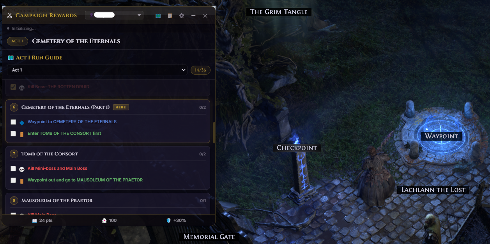
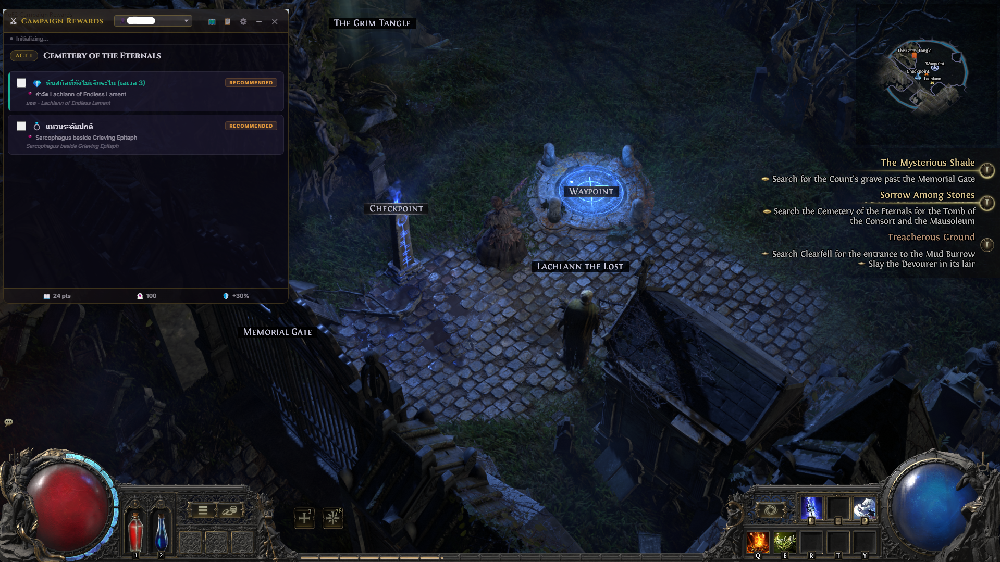
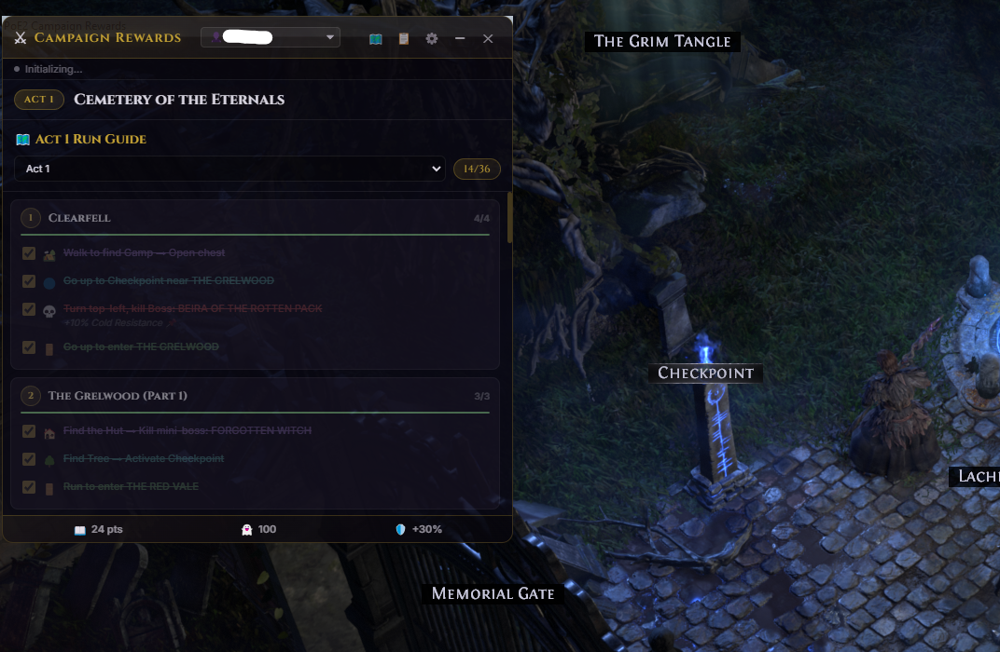

# PoE2 Campaign Rewards Overlay

[](https://github.com/HelloWorldCH/HW-campaign-rewards/releases)
[](https://github.com/HelloWorldCH/HW-campaign-rewards/releases)
[](https://github.com/HelloWorldCH/HW-campaign-rewards/blob/main/LICENSE)
[](https://discord.gg/hJMWSMRckJ)

โปรแกรม Overlay สำหรับบอกข้อมูลของรางวัลจากการทำเควส (Campaign Rewards) ในเกม Path of Exile 2 

💬 **เข้าร่วมพูดคุย แจ้งปัญหา หรือติดตามอัปเดตได้ที่ Discord:** [https://discord.gg/hJMWSMRckJ](https://discord.gg/hJMWSMRckJ)

## 📸 ภาพตัวอย่างโปรแกรม (Screenshots)






## 📥 วิธีดาวน์โหลดสำหรับผู้ใช้งานทั่วไป (Normal Users)

หากคุณแค่ต้องการดาวน์โหลดโปรแกรมไปใช้งานเล่นเกม:
1. ไปที่หน้า [Releases](https://github.com/HelloWorldCH/HW-campaign-rewards/releases)
2. ดาวน์โหลดไฟล์ `.exe` เวอร์ชั่นล่าสุด
3. เปิดไฟล์และใช้งานได้ทันที (ดูคู่มือการใช้งานแบบเต็มๆ ได้ที่ไฟล์ [wiki.md](wiki.md))

---

## 🛠️ สำหรับนักพัฒนา (Developers)

หากคุณต้องการแก้ไขโค้ดหรือคอมไพล์โปรแกรมด้วยตัวเอง:

### ความต้องการของระบบ (Prerequisites)
- [Node.js](https://nodejs.org/) (แนะนำเวอร์ชัน 18 ขึ้นไป)
- โปรแกรมเกม Path of Exile 2

### วิธีการติดตั้ง (Installation)

1. เปิด Terminal หรือ Command Prompt ไปที่โฟลเดอร์ของโปรเจกต์
2. รันคำสั่งต่อไปนี้เพื่อติดตั้ง Dependencies ทั้งหมด:
   ```bash
   npm install
   ```

### วิธีรันโหมดพัฒนา (Development Mode)

โหมดนี้เหมาะสำหรับการแก้ไขโค้ดและทดสอบการทำงาน เมื่อรันคำสั่ง โปรแกรมจะเปิดขึ้นมาทันที

```bash
npm run dev
```

*หมายเหตุ: ในขณะที่เปิดโหมด Dev หากมีการแก้ไฟล์และบันทึก อาจจะต้องปิดและรัน `npm run dev` ใหม่เพื่อให้ระบบรีโหลดโค้ด (หรือใช้ `Ctrl + R` ในหน้าต่าง Overlay)*

## วิธีการ Build เป็นไฟล์ .exe (Production)

เมื่อแก้ไขโค้ดจนพอใจแล้ว คุณสามารถสร้างไฟล์ `.exe` สำหรับนำไปใช้งานจริงได้ โดยทำตามขั้นตอนนี้:

1. **สำคัญมาก:** หากโปรแกรม Overlay ยังเปิดค้างอยู่ ให้คลิกขวาที่ไอคอนมุมล่างขวาของจอแล้วเลือก **Quit** เพื่อปิดโปรแกรมให้สนิทก่อน (ไม่เช่นนั้นระบบจะฟ้องว่าไฟล์ถูกล็อก - `EBUSY`)
2. รันคำสั่งต่อไปนี้ใน Terminal:
   ```bash
   npm run build
   ```
3. รอจนกว่าระบบจะทำงานเสร็จ เมื่อเสร็จแล้ว จะมีโฟลเดอร์ชื่อ `dist` ถูกสร้างขึ้นมา
4. เข้าไปในโฟลเดอร์ `dist/PoE2 Campaign Rewards-win32-x64/`
5. คุณจะพบไฟล์ `PoE2 Campaign Rewards.exe` สามารถคลิกเพื่อใช้งานได้ทันที (หรือส่งโฟลเดอร์นี้ให้เพื่อนได้เลย)

## ระบบเด่นของเวอร์ชันนี้
- **Auto-Map Detection**: ตรวจจับแผนที่อัตโนมัติจากการอ่านไฟล์ `Client.txt` ของเกม
- **Character Profiles**: มีระบบสร้างโปรไฟล์ตัวละคร ทำให้สามารถบันทึกและแยกเช็คลิสต์การเก็บรางวัลแต่ละตัวละคร (Alts) ได้อย่างอิสระ
- **Smart Pop-up**: โปรแกรมจะแจ้งเตือนเมื่อเข้าด่าน และหากเป็นด่านที่ไม่มีของรางวัล (เช่น ในเมือง) โปรแกรมจะโชว์ชื่อด่านแล้วซ่อนตัวเองใน 4 วินาทีเพื่อไม่ให้บังหน้าจอ
